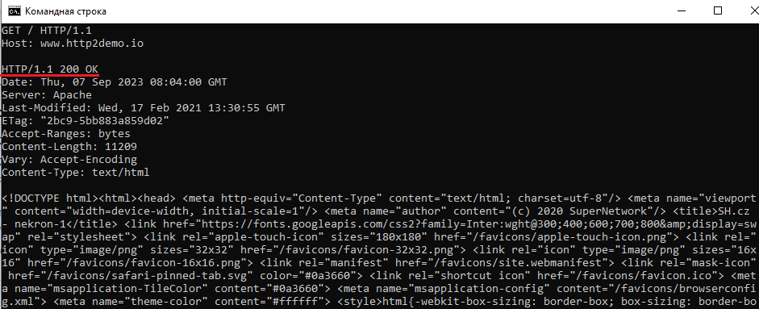
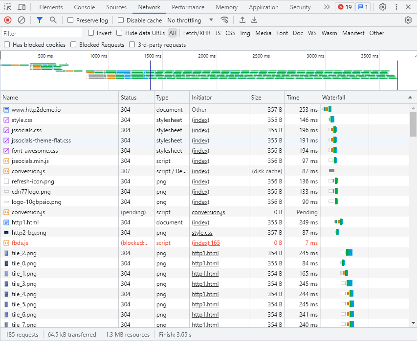
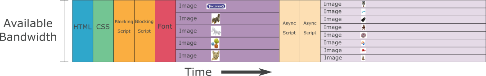
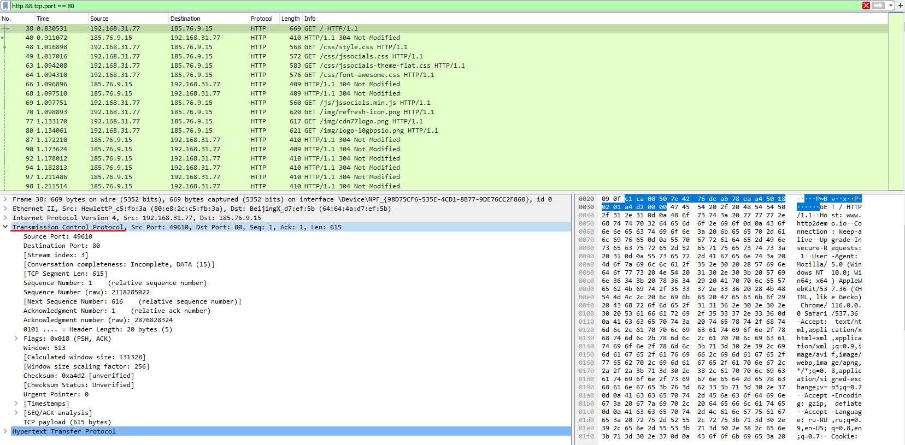
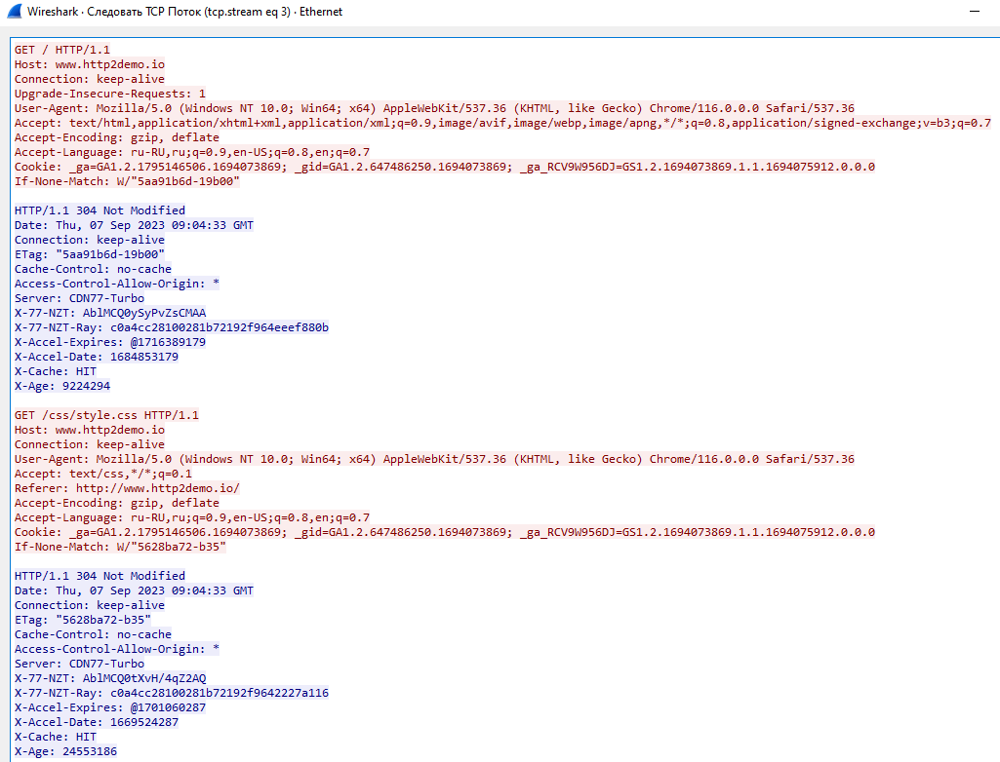
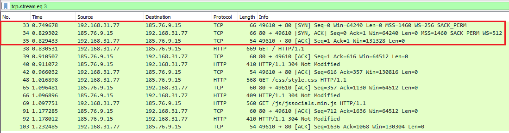

# Практическое задание №1

Цель: познакомится с протоколом HTTP, увидеть внутреннюю структуру обмена
клиента и сервера.

## Задание №1

**Задача:** Выполнить GET запрос через telnet на выбранный хост.

**Выполнение:**

Для подключения к удаленному хосту `telnet http2demo.io 80`. 
Далее выполняю GET запрос как указано на скриншоте.  

  

На скриншоте видны код ответа 200 и полученная html страница.
Пришлось дополнительно искать хост, который поддерживает http протокол заместо https, так как
большинство современных хостов используют https для безопасности. Как пример `ya.ru`, 
в случае GET запроса по http протоколу - код ответа 301 (Moved permanently).  

## Задание №2

**Задача:** Проделать предыдущее задание, но теперь с использование браузера и инструментов разработчика.

**Выполнение:**

Список переданных ресурсов при переходе по ссылке [http2demo](http://http2demo.io)
(фактический GET запрос выполненный через браузер)

Видно, что передано было 64.5 kB ресурсов в сжатом виде (изначальный их размер 1.3 MB).
Затраченное время на получение составило 3.65 s.

Сначала передаётся DTD файл (схема), далее загружаются .css файлы стилей, .js файлы и
в самом конце медиа ресурсы.

От указанного порядка загрузки ресурсов - будет зависить скорость доступа к сайту/ресурсу (время его загрузки).
Разница по скорости загрузки между оптимальным и неоптимальным порядками может составлять 50% и более.
Ниже приведена диаграма с оптимальным порядком загрузки ресурсов.

## Задание №3

**Задача:** Проделать предыдущее задание, дополнительно проанализировать сетевой трафик через `wireshark`.

**Выполнение:**

После запуска wireshark и перехода по указанной ссылке производим кратковременную запись трафика сети.
Далее сортируем трафик по условиям, что прикладной протокол - http и порт 80.

Можно наблюдать, что используемый транспортный протокол - tcp. И непосредственную информацию переданную в пакете.

Проследовав за потоком можно отследить запросы от браузера, и ответы полученные от сервера.
Коды ответа в данном случае - 304, это означает, что запрашиваемый ресурс - закэширован.

Также можно просмотреть более подробную информацию, на которой видно так называемое "рукопожатие"
используемое tcp протоколом. И уже последующую передачу пакетов между клиентом и сервером.

